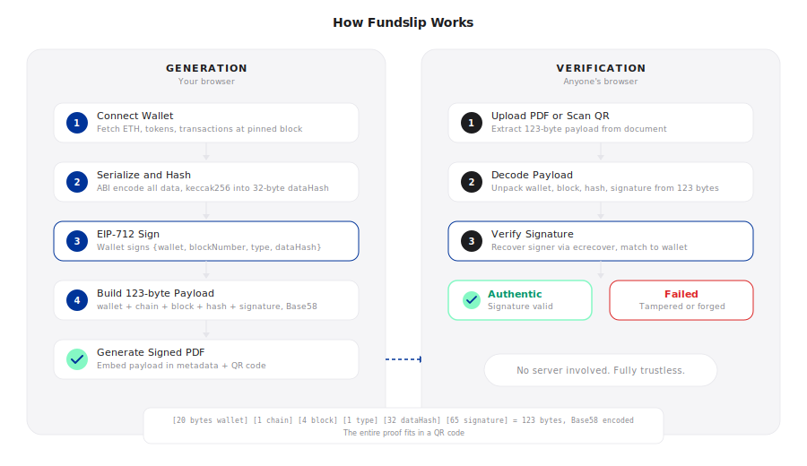

<p align="center">
  
</p>

<p align="center">
  <a href="https://fundslip.xyz">Website</a> ·
  <a href="https://fundslip.xyz/generate">Generate</a> ·
  <a href="https://fundslip.xyz/verify">Verify</a> ·
  <a href="https://x.com/fundslip">Twitter</a>
</p>

<p align="center">
  <a href="LICENSE"></a>
  <a href="https://github.com/fundslip/fundslip"></a>
  <a href="https://github.com/fundslip/fundslip/issues"></a>
  
</p>

---

## The Problem

You hold $200K in crypto. You need to prove it to a landlord, a mortgage officer, an accountant, or a visa officer. But there is no bank statement for Ethereum.

You could screenshot your wallet. But anyone can fake a screenshot. You could show your address on Etherscan. But that does not prove you *own* the wallet, only that someone looked at it.

What you need is a **financial statement that anyone can verify is real**, signed by the person who actually controls the wallet.

That is what Fundslip does.

## How It Works

Fundslip generates professional PDF financial statements from your Ethereum wallet. But unlike a screenshot or an API export, every statement carries a **cryptographic proof** that makes it impossible to forge.

### 1. Connect and Generate

You connect your wallet, choose a time period, and Fundslip reads your on-chain data:

- ETH balance (in wei, directly from the blockchain)
- ERC-20 token balances (25+ tracked tokens via multicall)
- Transaction history (from Blockscout, filtered by period)
- Current USD prices (from CoinGecko)

All data is fetched **client-side** in your browser. Nothing is sent to any server.

Every data point is pinned to a specific block number, a snapshot frozen in time.

### 2. Sign

This is where Fundslip becomes fundamentally different from "just pulling wallet data."

Your browser takes all the fetched data, every balance, every token, every transaction hash, and **deterministically serializes** it into a single byte sequence using Ethereum's ABI encoding. Token addresses are sorted, transaction hashes are sorted, everything is in raw integer form (wei, not ETH). The same data always produces the exact same bytes.

That byte sequence is hashed with keccak256 into a 32-byte `dataHash`.

Then your wallet is asked to sign an [EIP-712](https://eips.ethereum.org/EIPS/eip-712) typed data message:

```
{
  wallet:        0x1234...         // your address
  blockNumber:   19452102          // pinned block height
  statementType: 1                 // balance/full-history/income
  dataHash:      0xabcd...         // keccak256 of all your data
}
```

This is a structured, human-readable message. Your wallet shows you exactly what you are signing. No blind signatures.

**What this proves:** The owner of this wallet, at this moment, attested to this exact on-chain state. The signature is cryptographically bound to the data. Change one transaction, one balance, one byte, and the signature breaks.

### 3. Verify

The signature, wallet address, block number, and data hash are packed into a **123-byte payload**:

```
20 bytes -- wallet address
 1 byte  -- chain ID
 4 bytes -- block number
 1 byte  -- statement type
32 bytes -- data hash
65 bytes -- ECDSA signature (r, s, v)
-----------
123 bytes total
```

This payload is Base58-encoded (~168 characters) and embedded in the PDF, in the metadata, in a QR code, and as a visible fingerprint at the bottom.

**Anyone can verify the statement.** Upload the PDF, scan the QR code, or paste the verification code at [fundslip.xyz/verify](https://fundslip.xyz/verify). The verifier's browser:

1. Decodes the 123-byte payload
2. Reconstructs the EIP-712 message
3. **Recovers the signer** from the signature using `ecrecover`
4. Confirms the recovered address matches the claimed wallet
5. Re-fetches on-chain data to display the current state

If the signature is valid, the statement is authentic. If it has been tampered with, verification fails. No server is involved. No trust is required.

## Architecture

<p align="center">
  
</p>

## Why Not Just Use Alchemy or Etherscan?

Anyone can call `eth_getBalance` on any wallet. That proves nothing, it is public data.

The difference is **attestation**. When you sign a Fundslip statement, you are creating a cryptographic proof that says:

> "I, the controller of wallet 0x1234..., at block #19,452,102, attest that this is my financial state."

This proof:

- **Cannot be created by anyone else** because it requires your private key
- **Cannot be modified after signing** because any change invalidates the signature
- **Can be verified by anyone** without an API key, account, or server
- **Is self-contained** because the 123-byte payload has everything needed

An Alchemy export has none of these properties. It is data without identity, without attestation, without integrity.

## What Gets Tracked

**Assets:**
ETH and 25+ major ERC-20 tokens including USDC, USDT, DAI, WETH, WBTC, LINK, UNI, AAVE, MKR, stETH, rETH, cbETH, and more.

**Statement Types:**
- **Balance Snapshot** -- holdings at a specific block height
- **Full Transaction History** -- complete send/receive/contract audit for a period
- **Income Summary** -- incoming transfers only (for tax/income proof)

**Networks:**
Ethereum mainnet. L2 support (Optimism, Arbitrum, Base) is planned.

## Security Model

| Property | Guarantee |
|---|---|
| **Authentication** | EIP-712 signature proves wallet ownership |
| **Integrity** | keccak256 hash binds signature to exact data |
| **Non-repudiation** | Wallet owner cannot deny signing |
| **Portability** | 123-byte payload works offline, in PDFs, via QR |
| **Trustlessness** | No server, no database, no authority needed |
| **Determinism** | Same data always produces same hash |
| **Tamper evidence** | Any modification breaks the signature |

**What we never see:** Your private keys, your seed phrase, your personal data. Everything runs in your browser.

**What is public:** On-chain data (balances, transactions) is already public on Ethereum. Fundslip does not expose anything that is not already on the blockchain.

## Tech Stack

| Layer | Technology |
|---|---|
| Framework | Next.js 16, React 19, TypeScript |
| Styling | Tailwind CSS 4 |
| Blockchain | viem, wagmi, EIP-712 |
| PDF | jsPDF, pdf-lib, pdfjs-dist |
| QR | qrcode, html5-qrcode |
| Animations | Framer Motion |

## Getting Started

```bash
git clone https://github.com/fundslip/fundslip.git
cd fundslip
npm install
npm run dev
```

Open [http://localhost:3000](http://localhost:3000).

The only environment variable is `RESEND_API_KEY` for optional email delivery. Everything else works out of the box.

## Project Structure

```
src/
├── app/                    # Next.js pages
│   ├── page.tsx            # Homepage
│   ├── generate/           # Statement generation
│   ├── verify/             # Statement verification
│   └── privacy/            # Privacy policy
├── components/
│   ├── home/               # Hero, features, CTA
│   ├── generate/           # Generation flow UI
│   ├── verify/             # Verification flow UI
│   ├── layout/             # Navbar, footer
│   └── shared/             # PDF viewer, calendar, etc.
├── hooks/
│   └── use-statement.ts    # Core generation orchestrator
├── lib/
│   ├── verification/       # Cryptographic core
│   │   ├── serialize.ts    # Deterministic ABI encoding
│   │   ├── sign.ts         # EIP-712 message builder
│   │   ├── payload.ts      # 123-byte payload codec
│   │   ├── verify.ts       # Signature verification
│   │   └── pdf-extract.ts  # PDF metadata embedding
│   ├── ethereum.ts         # On-chain data fetching
│   ├── pdf.ts              # PDF generation
│   └── prices.ts           # Token price feeds
└── types/                  # TypeScript definitions
```

## Use Cases

- **Rental applications** -- prove you can afford the rent
- **Mortgage pre-approval** -- show liquid crypto holdings
- **Tax reporting** -- document income from DeFi
- **Visa applications** -- proof of funds for immigration
- **Grant applications** -- demonstrate treasury holdings
- **Audit trails** -- verifiable point-in-time snapshots
- **Legal proceedings** -- court-admissible financial evidence

## FAQ

**Is this a bank statement?**
No. It is a cryptographically signed attestation of on-chain financial data. But it serves the same purpose: proving what you hold and what you have transacted.

**Can someone fake a statement?**
No. Creating a valid signature requires the wallet's private key. Without it, the signature verification fails.

**What if someone edits the PDF?**
The visible PDF content is a human-readable convenience. The cryptographic proof is in the embedded payload. Verification always re-fetches on-chain data. If the PDF text has been altered, the verifier sees the real data, not the edited text.

**Does this work offline?**
Generation requires internet (to fetch on-chain data and sign). Verification requires internet (to re-fetch data). The PDF itself works offline as a document.

**Is this open source?**
Yes. Every line. [Read the code](https://github.com/fundslip/fundslip).

## Contributing

Contributions are welcome. See [CONTRIBUTING.md](CONTRIBUTING.md) for guidelines.

Please read our [Code of Conduct](CODE_OF_CONDUCT.md) before participating.

## License

[MIT](LICENSE)
